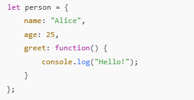
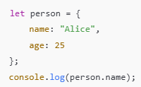
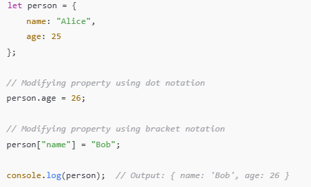
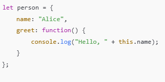
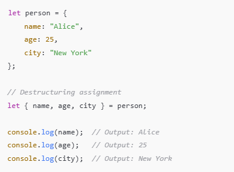
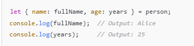
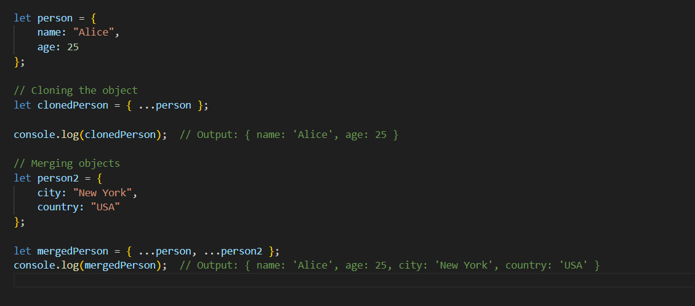

1.  What is JavaScript?

    ans => Javascript is light weight, cross platform, single threade language, this is used to dynamic content for website. it's have miltiple freamwork.

2.  What is the difference between b/w let and var.

    ans =>

    | let                                                            | Var                                                     |
    | -------------------------------------------------------------- | ------------------------------------------------------- |
    | let have been intruduced in ES6 version.                       | var are have in both ES5 and ES7.                       |
    | let is have function scope.                                    | var are have globle scope variable.                     |
    | Variables defined with let cannot be redeclared.               | but in var we can do.                                   |
    | Access Before Declared Not -- allowed (throws ReferenceError). | Access Before Declared -- Allowed (value is undefined). |

3.  Why do we prefer const over var?

    ans => var.

         Block Scope:

    const is block-scoped, while var is function-scoped, reducing unintended variable access.
    Immutability: const prevents reassignment, ensuring safer code for constants.

         No Hoisting Issues:

    Accessing const before declaration throws an error, while var returns undefined.
    Readability: const clearly signals intent for variables not to be reassigned.
    Modern Best Practices: Encourages cleaner, safer, and more maintainable code.

4.  What is the use of javascript in web browsers?

    ans => avascript in web browsers.

         1.  Interactive Elements,
         2.  Dynamic Content Updates,
         3.  Single-Page Applications (SPAs),
         4.  Event Handling,
         5.  Asynchronous Operations,
         6.  Browser APIs,
         7.  Real-Time Communication.

5.  What are Objects?

    ans => object has cantent the data in key value pair,
    object is have change the data in realtime.

6.  What is an array and how is it different from an Object in Javascript?

    ans => arrayis content the data in the form of index, index is start from 0, Use objects for structured data with key-value pairs.

7.  What is a function?

    ans =>
    a). A JavaScript function is a block of code designed to perform a particular task. when we want to call it.

8.  How can we implement call by value and call by reference in Javascript?

    ans => call by value => When we will be access any data and we not get exect memory address Passes a copy of the value. It is have in the primitive data type in js.
    call by refrence => When we will be access any data and we get exect memory address Passes a reference to the original. It is have in the object and array data type in js.

9.  What are the primitive data types in Javascript?

    ans => those data type is have predefine, we will call primitive data type, it is have immutable.

10. What is DOM?

    ans => DOM stand for the "Document Object MOdel", dom is tree like stucture those are do use in select the item (id, class, tag, etc.) and perform operation on it.

11. Why do we need DOM?

    ans => DOM is allowing developers to manipulate the structure, style, and content of a document

12. Why do we use functions in JavaScript?

    ans => function.

        a. Break the large task in small task.
        b. Imrove code efficiency.
        c. Use the same code with different arguments.

13. What is Function Invocation?

    ans => Function invocation is the process of calling a function in a computer program and executing its defined actions. It's also known as calling a function.

14. Does a function behave like an object in Javascript? Prove it by an example.

    ans => Yes, in JavaScript, functions are objects. They are a special type of object known as callable objects, meaning they can have properties and methods, just like objects, while also being executable.

15. What are Events in Javascript?

    ans => In JavaScript, events are actions or occurrences that happen in the browser or a web page, which JavaScript can detect and respond to. These events can be triggered by user interactions, browser actions, or other factors.

16. What is a string?

    ans => A string is a sequence of one or more characters that may consist of letters, numbers, or symbols. Strings in JavaScript are primitive data types and immutable, which means they are unchanging.

17. What is an array? Is it static or dynamic in Javascript?

    ans => An array in JavaScript is a type of global object used to store data. Arrays can store multiple values in a single variable,

18. Difference between Map and Set?

    ans => Map is a collection of ordered key/value pairs, and that a Set is a collection of unique values.

19. Difference between Array and Map?
20. What are array methods? List a few names?

    ans => Array methods in JavaScript are built-in functions that operate on arrays to perform various tasks such as adding, removing, modifying, or iterating through elements.

        push(), pop(), shift(), unshift(), splice(), slice(), map(), filter(),

21. In how many ways can we traverse through an array in Javascript

    ans => loop.

        for loop
        for...of loop
        for...in loop
        forEach()
        map()
        while loop
        do...while loop
        reduce()
        filter()

22. What are anonymous functions in JavaScript?

    ans => In JavaScript, anonymous functions are functions that are declared without a name. These functions are often used as values for variables, passed as arguments to other functions, or used as immediately invoked function expressions (IIFE).

23. Explain strict comparison and Abstract comparison in javascript?

    ans => strict comparision is Checks value and type (===, !===). in the other hand Abstract comparision is check only value (==, !=).

24. Difference b/w arrow functions and regular functions.

    ans =>

    | Arrow                                   | reguler                                |
    | --------------------------------------- | -------------------------------------- |
    | Concise syntax.                         | Standard syntax with function keyword. |
    | this is lexically bound.                | this is dynamically bound.             |
    | No arguments object.                    | Has arguments object.                  |
    | Cannot be used as a constructor.        | Can be used as a constructor.          |
    | Implicit return for single expressions. | Requires explicit return.              |

25. What is Hoisting in JavaScript?

    ans => Hoisting is JavaScript's default behavior of moving declarations (variables, functions) to the top of their scope during the compile phase. This means you can use variables or functions before declaring them in the code.

        ===========Hoisting in ES5
        Variable Hoisting (var):

        var declarations are hoisted to the top of their scope but not initialized.
        Accessing the variable before declaration results in undefined.

    .

        ===========Hoisting in ES6
        let and const Hoisting:

        Declarations are hoisted, but they remain in a Temporal Dead Zone (TDZ) until initialized.
        Accessing them before declaration results in a ReferenceError.

26. JavaScript is a garbage collected programming language, explain how?

    ans => Garbage collection (GC) in JavaScript refers to the automatic process by which the JavaScript engine reclaims memory that is no longer in use, freeing up resources for new data. It helps prevent memory leaks by identifying and removing unreachable objects from memory.

27. Explain Shallow copy vs Deep copy in Javascript?

    ans =>

28. What is Object.freeze

    ans => Object.freeze() is a method that freezes an object, making it immutable. Once an object is frozen, you can no longer add new properties, modify existing properties, or delete properties. However, the values of properties in the object can still be changed if those properties themselves are objects (unless they are also frozen).

29. Explain as much as you know about objects in javascript? (A long answer expected).

    ans => An object is an unordered collection of key-value pairs. The keys are also known as properties, and the values can be of any data type (primitives, other objects, functions, etc.).

    1). Syntex of create of Object. =>

    

    2). Accessing Object Properties with Dot Notation. =>

    

    3). Manuplate the object. =>

    

    4). Delete object properties. =>
    delete.person.age

    5). In JavaScript, this refers to the object from which the method is being called. Inside methods, this refers to the object itself.

    

    6). Object destructuring is extract multiple properties from an object into variables.

    

    we will also do rename the object properties.

    

    7). Object.seal(): Prevents adding or deleting properties from an object but allows modification of existing properties.

    8). Object.freeze(): Prevents any modifications to an object (both properties and their values).

    9). Some more object method. =>

        Object.keys() – Returns an array of an object's keys.

        Object.values() – Returns an array of an object's values.

        Object.entries() – Returns an array of key-value pairs.

        Object.assign() – Copies properties from one object to another.

        Object.create() – Creates an object with a specified prototype.

    9). can use the spread operator (...) to clone an object or merge objects.

    

30. What is futur of JavaScript.

    ans =>

        1.  JavaScript has a bright future as it keeps evolving and staying at the heart of web development. Here's the summary in simple terms:

        2.  Better Tools and Frameworks: Popular ones like React, Angular, and Vue are improving, and new ones like Svelte are making things simpler and faster.

        3.  AI and Machine Learning: JavaScript is being used to run AI directly in web browsers.

        4.  WebAssembly: It’s teaming up with other languages to make apps super fast.

        5.  Backend Growth: JavaScript isn’t just for websites anymore; tools like Node.js make it great for server work too.

        6.  TypeScript: A more organized way to write JavaScript, making big projects easier to manage.

        7.  Constant Updates: New features keep making JavaScript faster, smarter, and easier to use.

31. What is NodeJS?

    ans => Node.js is JavaScript that runs outside the browser. Normally, JavaScript is used for things like making websites interactive. But with Node.js, you can use JavaScript to write programs that run on your computer or server, not just in the browser.

32. What is V8 Engine?

    ans => The V8 Engine is a powerful JavaScript engine developed by Google. It is responsible for running JavaScript code, and it’s what powers JavaScript in Google Chrome and many other platforms, including Node.js.

33. What is Event Loop in NodeJS.

    ans => The Event Loop in Node.js is enables non-blocking, asynchronous programming. It's how Node.js handles multiple tasks at the same time while using only a single thread.

34. What is the use of tsconfig.json file?

    ans => This is configuration file used in TypeScript projects to define how the TypeScript compiler (tsc) should behave. It specifies the settings, rules, and options for compiling TypeScript files into JavaScript.

35. What are the methods provided by `fs` module to manipulate files?

ans => The fs (File System) module in Node.js provides various methods to work with the file system, such as reading, writing, updating, deleting, and managing files and directories. These methods are available in both synchronous and asynchronous versions.

36. What is API?

    ans => API (Application Programming Interface) is a set of rules and tools that allows different software applications to communicate with each other. It's help to communicate to front to backend also, it is travel with the data.

37. What is JSON format?

    ans => JSON data is written as key-value pairs inside curly braces {}. Keys are strings, and values can be different types.

    

38. Why we use JSON format for API?

    ans => We use the JSON format for APIs because it is simple, efficient, and well-suited for data exchange between systems.

        1). Lightweight and Compact.
        2). Easy to Read and Write.
        3). Language Independence.
        4). Native Support in JavaScript.
        5). Supports Nested Data.
        6). Efficient Data Parsing.
        7). Cross-Platform Compatibility.

39. What is a Framework?

    ans => A framework is a pre-built, reusable collection of tools, libraries, and guidelines that help developers build software applications more efficiently. It provides a structure or foundation that developers can build an application.

40. How an HTTP Communication works.

    ans =>TTP (HyperText Transfer Protocol) is the foundation of data communication on the web. It is used for transferring data between a client (web browser) and a server.

41. What is Middleware in ExpressJS.

    ans => Middleware functions are used to perform tasks before the request reaches the controller or before the response is sent back to the client.
